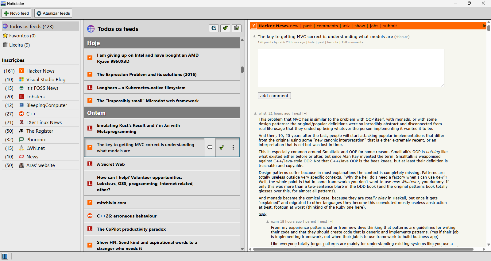

#  Noticiador
Um leitor de feeds RSS desenvolvido com Electron Forge + Typescript + React.



## Recursos
- Renderização de paginas através de *WebContentsView*
- Bloqueador de anúncios e rastreadores
- Favoritos
- Visualização de comentários (caso o feed contenha o elemento ```<comments>```)

## Plataformas suportadas
Windows 10+ e Linux

## Em andamento
- [ ] Importação/Exportação de arquivos OPML
- [ ] Controles de navegação (ex: voltar, avançar, recarregar, etc)
- [ ] Categorias (ex: Tecnologia, Esportes)
- [ ] Leia mais tarde
- [ ] Minimizar para a bandeja de sistema
- [ ] Iniciar com o sistema
- [ ] Atualização periódica em segundo plano
- [ ] Notificação de notícias novas
- [ ] Listas de bloqueio de anúncios customizadas
- [ ] Alterar idioma (português e inglês)
- [ ] Permitir controlar bloqueio de anúncios por site

## Instruções de build
Execute ```npm install``` seguido por ```npm make```

## Licença
GPL-3
